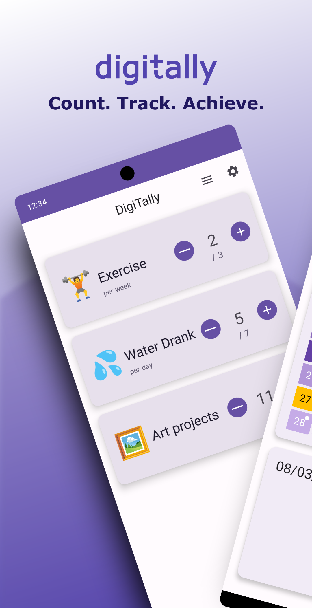
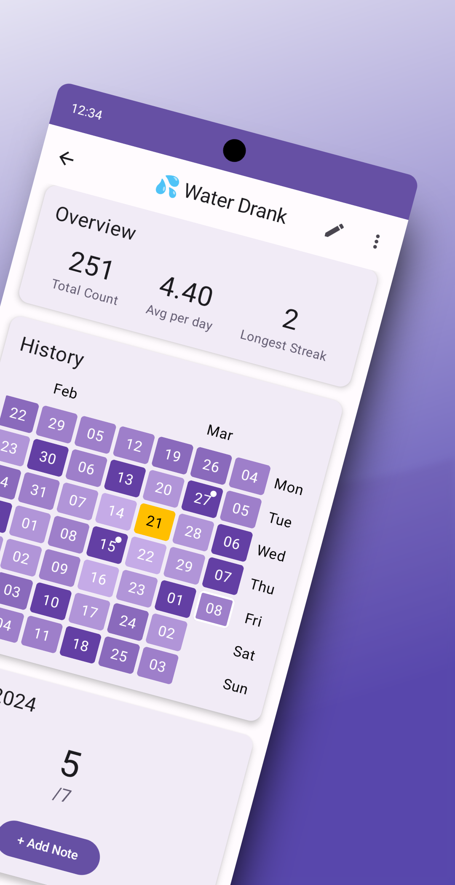
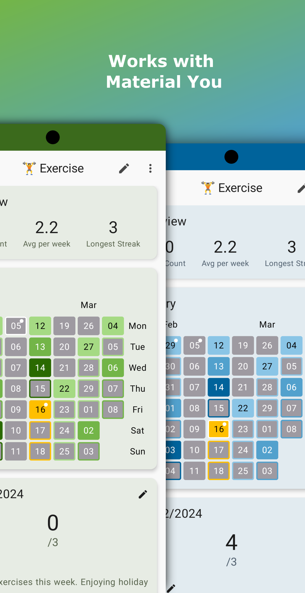
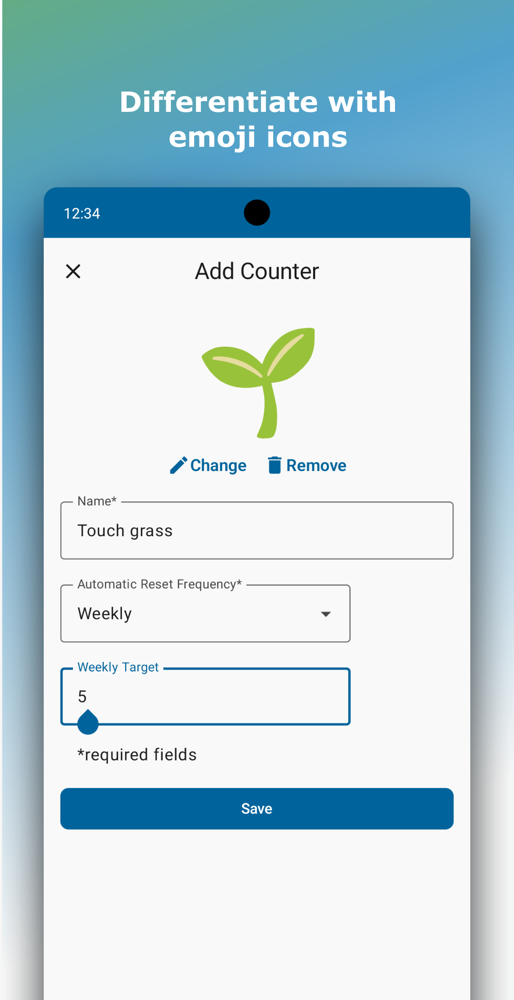

  

 

  A hybrid counter/habit tracker app built for Android devices using Kotlin and Jetpack Compose.

## Features
- 🔄 Able to automatically reset counts for daily/weekly counters
- 📦 Local storage with Room
- 📅 Historic calendar view inspired by Github's contributions calendar
- 🎉 Celebrate achievements with confetti when targets are reached ([Konfetti](https://github.com/DanielMartinus/Konfetti))
- 🎨 Dynamic Theming using Material You
- 🏗️ MVVM architecture

## Screenshots

    
    

    
    

